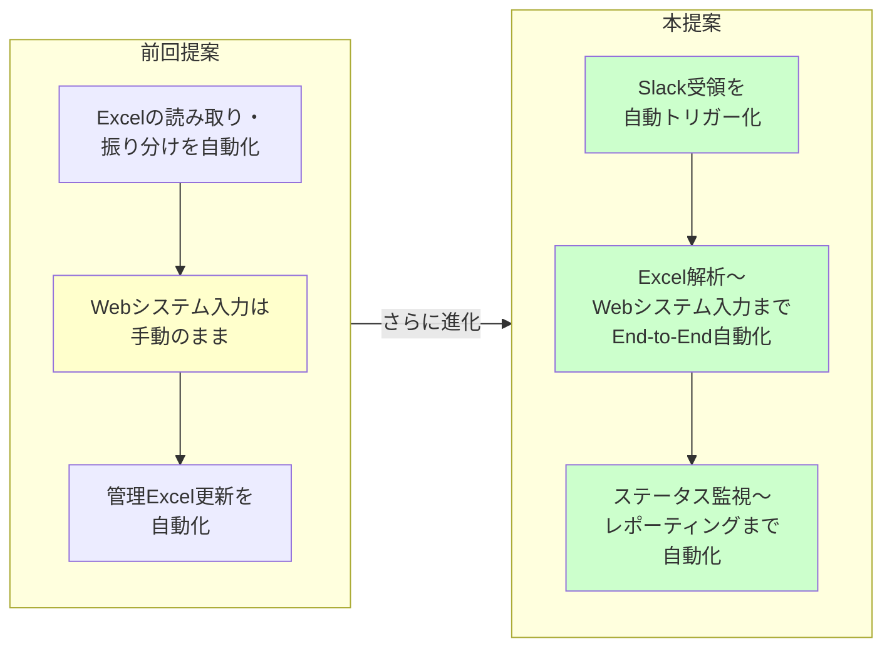
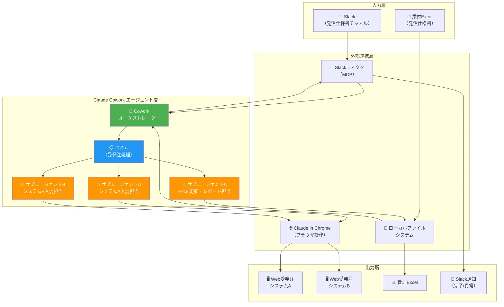
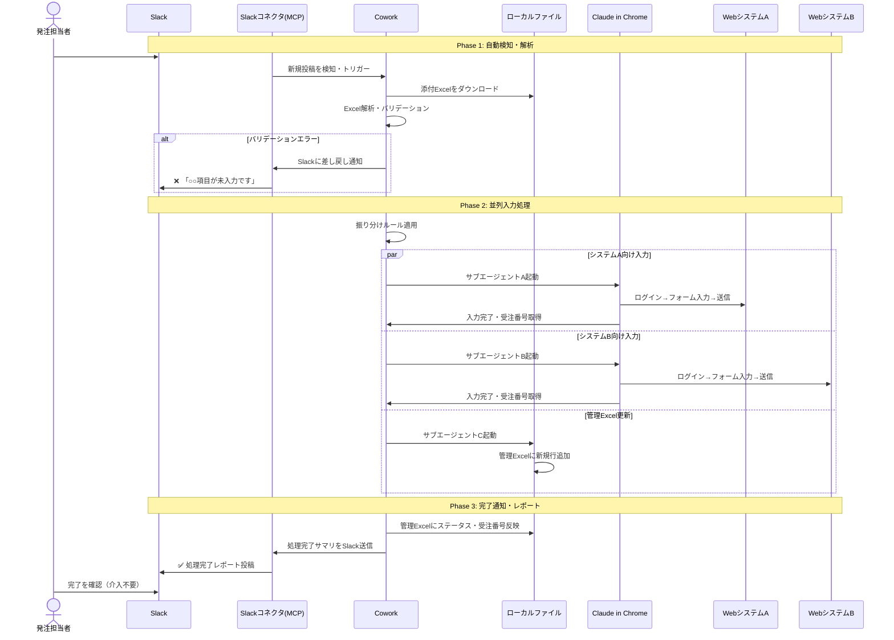
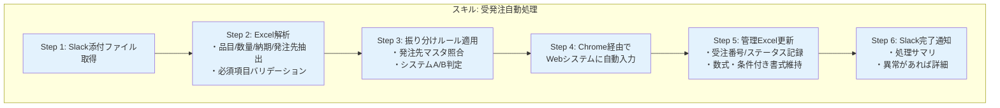
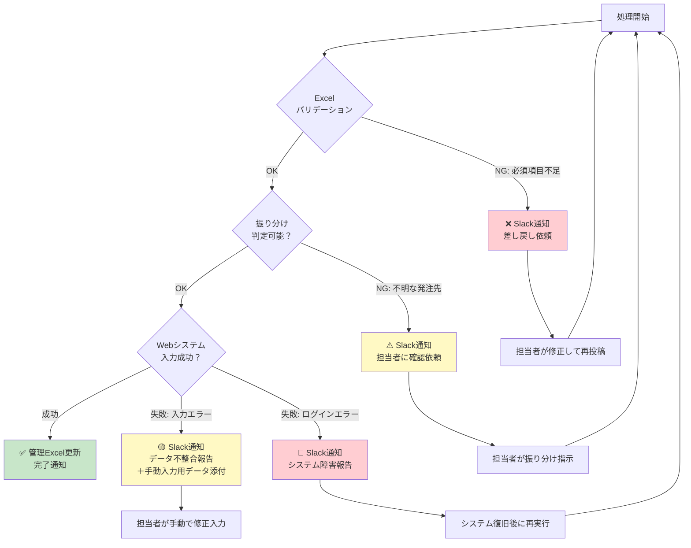
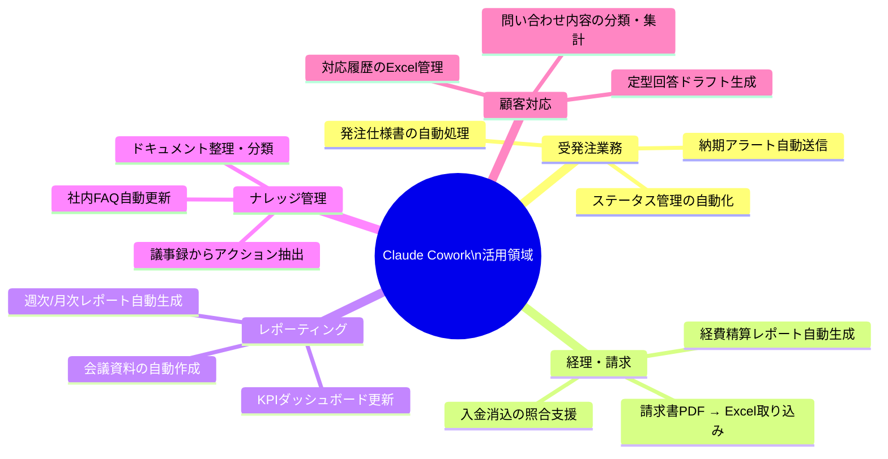
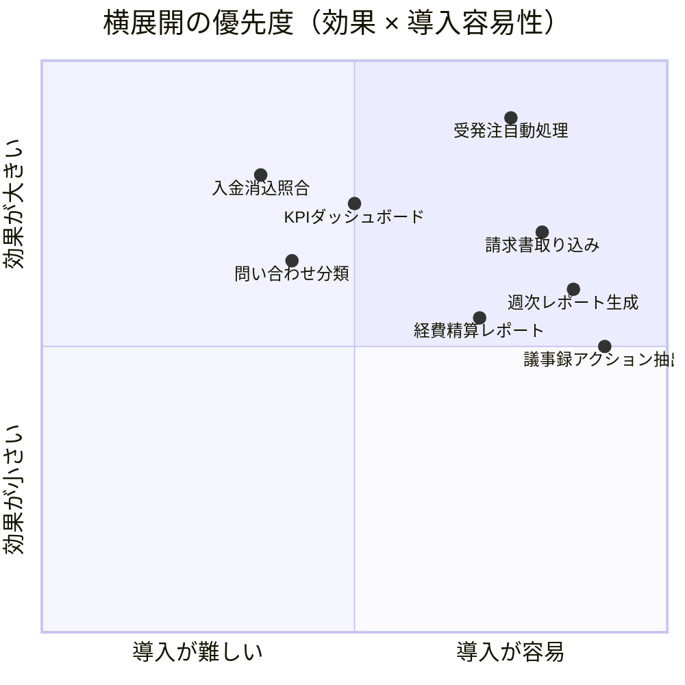
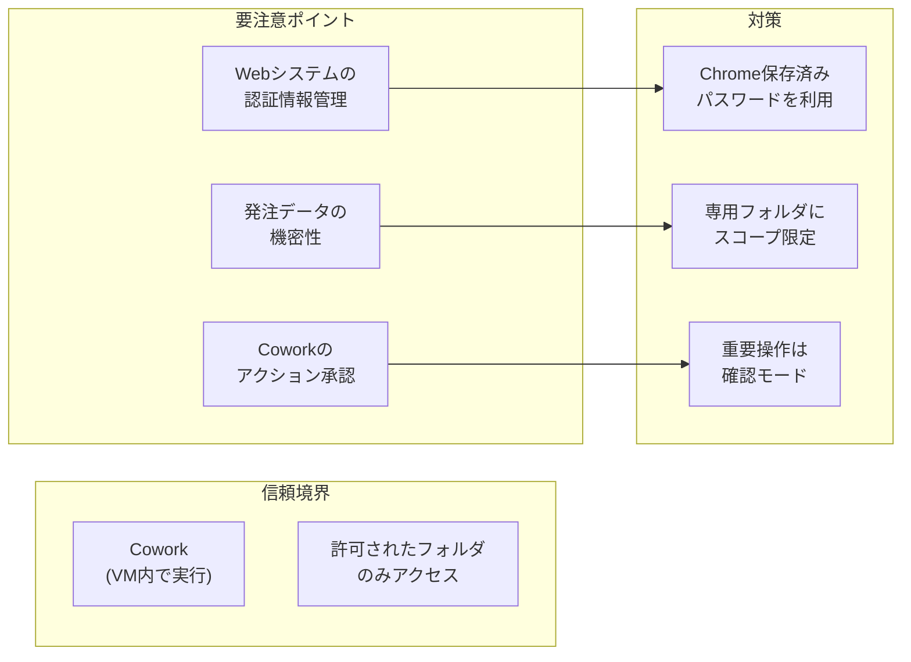
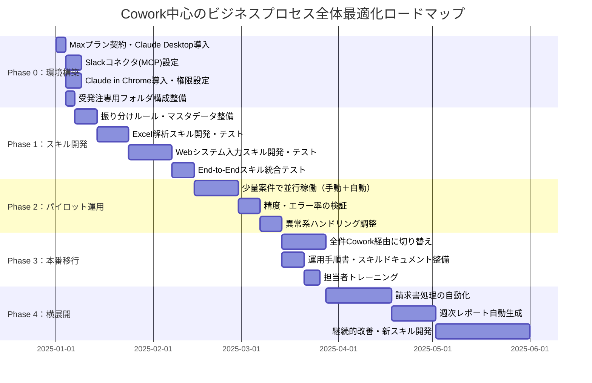
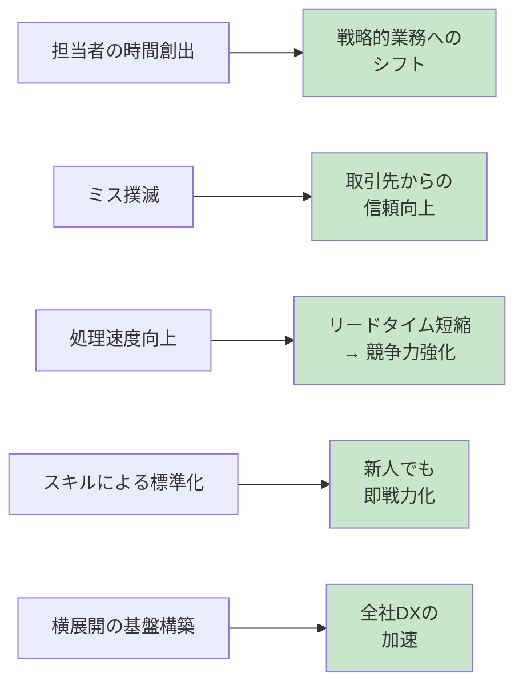

# Claude Cowork を中心としたビジネスプロセス全体最適化提案

## エグゼクティブサマリー

前回の提案では「現行業務の部分的な自動化」に留まっていた。本提案では、Claude Coworkの**エージェント機能・MCP連携・スキル機能・並列処理**をフル活用し、受発注業務を含むビジネスプロセス全体を再設計する。

ポイントは3つ：

1. **Slack → Cowork を直結**し、人が介在しない仕組みを作る
2. **Claude in Chrome との連携**で Web 受発注システムへの入力も自動化する
3. **スキル（再利用可能ワークフロー）** により、属人化を排除し組織ナレッジ化する

---

## 1. 前回提案との比較

| 比較軸 | 前回提案 | 本提案 |
|--------|---------|--------|
| 自動化範囲 | Excel読み取り〜データ準備 | Slack受領〜Web入力〜レポートまで |
| Web入力 | 手動（データ準備のみ自動） | Claude in Chrome連携で自動化 |
| トリガー | 手動でCowork起動 | Slackコネクタで自動検知 |
| 再利用性 | 毎回プロンプト記述 | スキルとして保存・再利用 |
| 並列処理 | 未活用 | サブエージェントで並列実行 |
| 異常検知 | なし | バリデーション＋Slack通知 |

---

## 2. 理想のアーキテクチャ全体像

---

## 3. 詳細ワークフロー

### 3.1 End-to-End 処理フロー

### 3.2 スキル（再利用可能ワークフロー）の設計

Coworkの「スキル」機能を使い、一度構築したワークフローを保存・再利用する。

> **スキルの利点**: 担当者が変わっても、同じスキルを呼び出すだけで同品質の処理が可能。属人化を完全に排除できる。

### 3.3 異常系のハンドリング

---

## 4. 受発注以外への横展開

Coworkの能力を受発注業務だけに閉じるのはもったいない。同じ仕組みで横展開できる業務を提案する。

### 横展開の優先度マトリクス

---

## 5. 技術要件と準備事項

### 5.1 必要なコンポーネント

| コンポーネント | 用途 | 現在の状況 |
|-------------|------|----------|
| **Claude Desktop (macOS)** | Cowork実行環境 | 要確認 |
| **Maxプラン** | Cowork利用に必要 | 要契約 |
| **Slackコネクタ (MCP)** | Slack↔Cowork連携 | 設定が必要 |
| **Claude in Chrome** | Webシステム操作自動化 | 拡張機能インストール済み |
| **ローカルファイルアクセス** | Excel読み書き | 権限設定が必要 |

### 5.2 セキュリティ考慮事項

**推奨設定：**
- Coworkのファイルアクセスは `受発注専用フォルダ` のみに限定
- Claude in Chromeは「Ask before acting」モードで運用開始
- 本番Web入力は、まずステージング環境で十分に検証してから移行

---

## 6. 導入ロードマップ（見直し版）

---

## 7. 期待される効果

### 定量的効果（推定）

| 指標 | 現状 | 前回提案 | 本提案 |
|------|------|---------|--------|
| 1件あたり処理時間 | 15〜30分 | 5〜10分 | **1〜3分**（確認のみ） |
| 担当者の関与度 | 100%手動 | 70%手動 | **10%（承認・例外対応のみ）** |
| 転記ミス発生率 | 月数件 | 大幅削減 | **ほぼゼロ** |
| 処理可能件数/日 | 15〜20件 | 30〜40件 | **100件以上** |
| 属人化リスク | 高 | 中 | **低（スキルで標準化）** |

### 定性的効果

---

## 8. リスクと緩和策

| リスク | 影響度 | 発生可能性 | 緩和策 |
|--------|--------|-----------|--------|
| Webシステムの UI 変更で自動入力が失敗 | 高 | 中 | 定期的なスキル保守、異常検知→Slack即時通知 |
| Coworkのセッション切断（macOS スリープ等） | 中 | 中 | 処理中はスリープ抑制設定、中断時の自動リトライ |
| 機密データの意図しない露出 | 高 | 低 | フォルダスコープ限定、確認モード運用 |
| Maxプランのコスト（$200/月〜） | 中 | 確実 | 削減できる人件費・ミスコストとのROI比較 |
| Coworkがリサーチプレビュー段階 | 中 | 中 | Phase 2で十分な検証、手動フォールバック手順を維持 |

---

## 9. 次のアクション

1. **Maxプランの契約判断** — ROIシミュレーションをもとに経営判断
2. **Slackコネクタの設定** — MCP経由でSlackチャネルをCoworkに接続
3. **振り分けルールの棚卸し** — 現在の暗黙知をルールテーブルとして文書化
4. **PoC実施** — 5件程度の実案件でEnd-to-End処理を試行
5. **スキル化・標準化** — PoCで確立したワークフローをスキルとして保存
