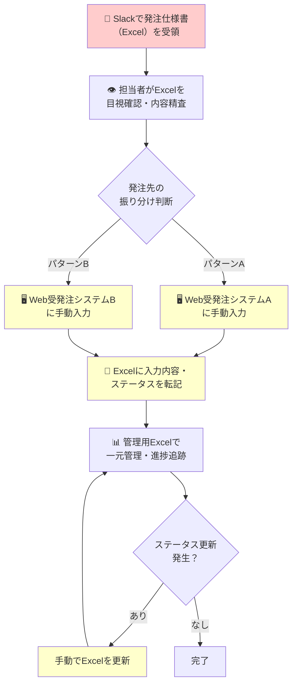
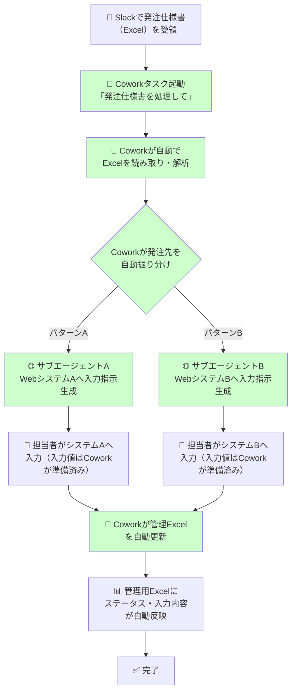
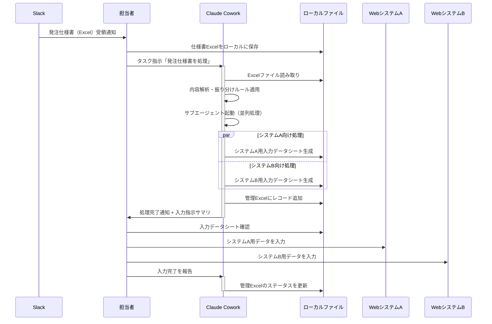
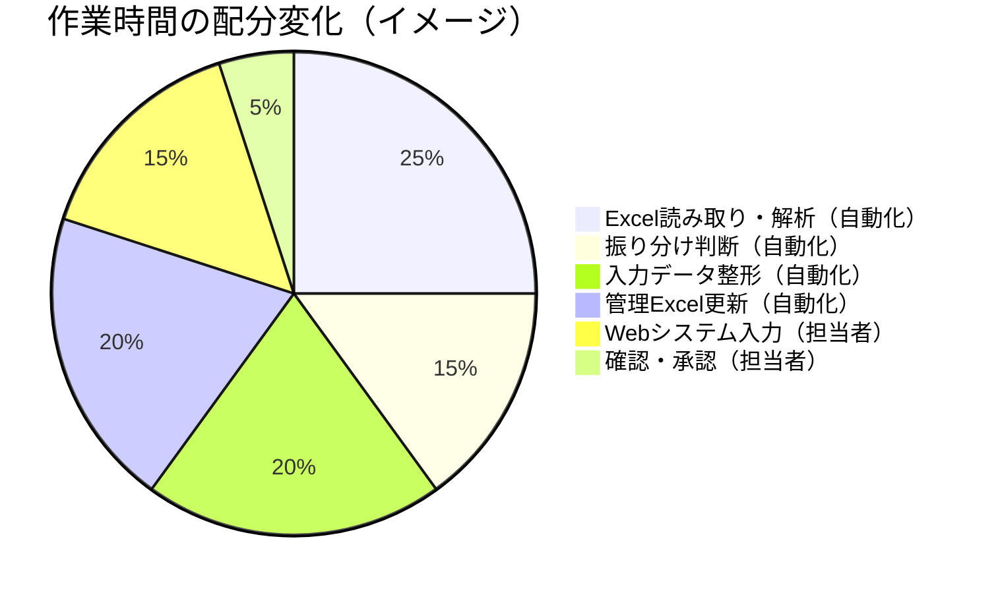
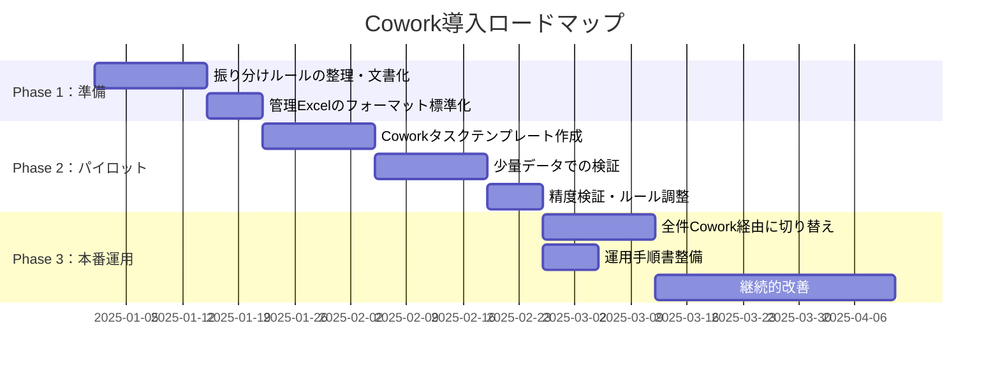

# Claude Cowork導入による受発注ワークフロー改善提案

## 1. 現状のワークフロー（As-Is）

### 概要

現在の受発注業務は、Slack・Excel・2つのWeb受発注システムにまたがる**手動入力中心のフロー**で運用されている。

1. Slack経由で発注仕様書（Excel）を受領
2. Excel の内容を確認し、2つのWeb受発注システムに手動で振り分け・入力
3. 入力結果やステータスをExcelに転記し、一元管理

### As-Is フロー図

### 現状の課題

| 課題 | 詳細 |
|------|------|
| **二重入力** | Excel → Webシステムへの転記が2系統で発生 |
| **転記ミスのリスク** | 手動コピーによる入力漏れ・誤入力 |
| **ステータス反映の遅延** | Webシステムの状態変化を手動でExcelに反映 |
| **属人化** | 振り分けルールやシステム操作が担当者依存 |
| **作業時間の浪費** | 単純転記に知識労働者の時間を消費 |

---

## 2. Cowork導入後のワークフロー（To-Be）

### Claude Coworkとは

Claude Coworkは、Claude Desktopアプリ上で動作するエージェント機能である。主な特長は以下のとおり。

- **ローカルファイルへの直接アクセス** — Excel等のファイルをアップロード不要で読み書き可能
- **サブエージェント並列処理** — 複雑なタスクを分割し、複数ワークストリームを同時実行
- **プロフェッショナルな出力** — 数式・書式付きExcelやレポートを直接生成
- **長時間タスクの継続実行** — タイムアウトなしにマルチステップ処理を完遂

### To-Be フロー図

> **注記:** 現時点ではCoworkはWebシステムへの直接ログイン・操作を自動で行うことはセキュリティ上推奨されない。Webシステムへの入力自体は担当者が行うが、入力データの準備・整形・振り分けと管理Excelの更新をCoworkが担う。

### 処理の詳細フロー

---

## 3. Cowork導入による改善効果

### 自動化される作業

### 効果まとめ

| 観点 | 現状（As-Is） | Cowork導入後（To-Be） |
|------|--------------|----------------------|
| **Excel読み取り** | 手動で目視確認 | Coworkが自動解析 |
| **振り分け判断** | 担当者が都度判断 | ルールベースで自動分類 |
| **入力データ準備** | 手動で転記 | Coworkがシステム別にデータ整形 |
| **Web入力** | 手動（変更なし） | 担当者が実施（ただしデータは準備済み） |
| **管理Excel更新** | 手動転記 | Coworkが自動更新 |
| **処理時間** | 1件あたり15〜30分 | 1件あたり5〜10分（推定） |
| **ミス発生率** | 転記ミスが散発 | データ準備段階でのミス大幅削減 |

---

## 4. 導入ステップ

---

## 5. 留意事項

- **Webシステムへの直接操作**: Coworkは現時点ではWebブラウザ操作の完全自動化を保証しない。Webシステムへの入力は引き続き担当者が行う想定とする。将来的にClaude in Chrome等との連携で自動化範囲を拡大できる可能性がある。
- **セキュリティ**: Coworkはローカルファイルにアクセスするため、アクセス権限を適切に設定すること。機密性の高い発注情報を扱う場合は、Claudeの計画を確認してから実行を許可する。
- **セッション管理**: Cowork実行中はClaude Desktopアプリを閉じないこと。アプリを閉じるとセッションが終了する。
- **利用プラン**: CoworkはMaxプラン限定（macOS Claude Desktopアプリのみ）のリサーチプレビューである。
