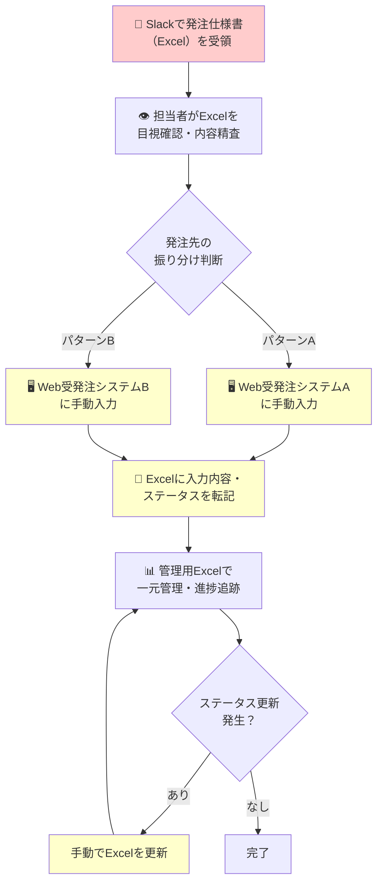
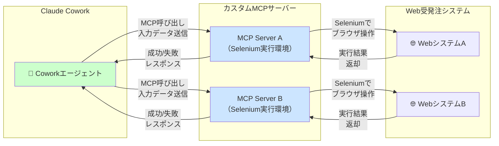
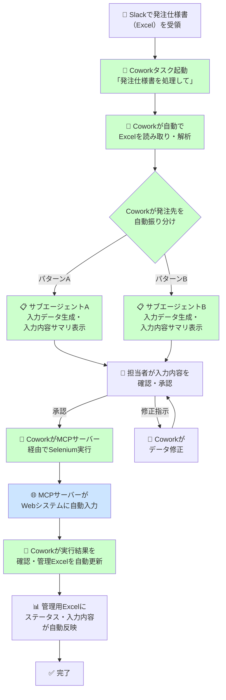
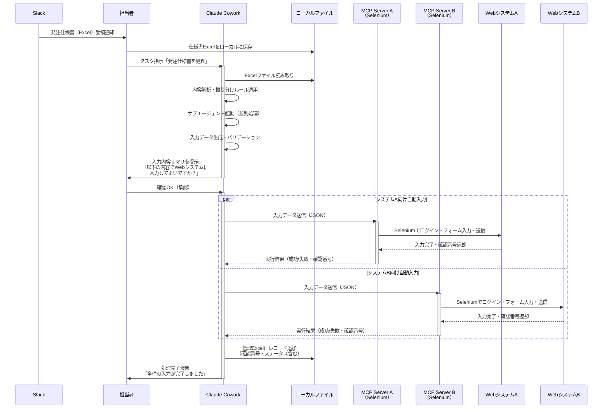
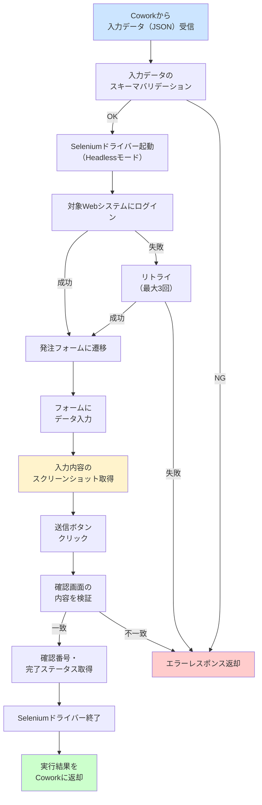
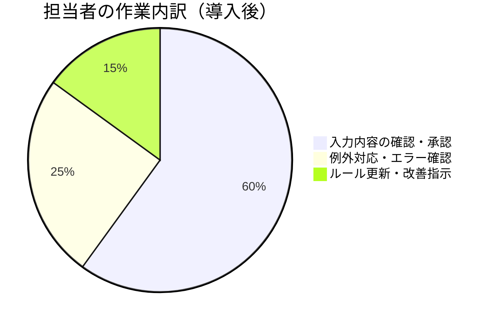
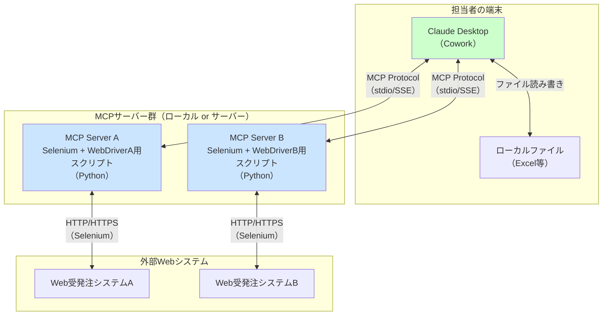
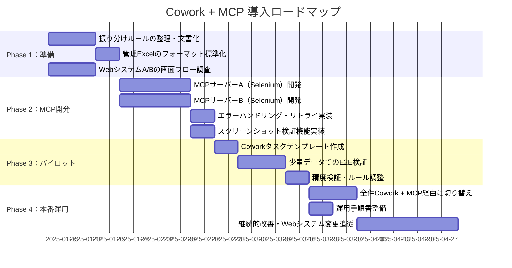

# Claude Cowork導入による受発注ワークフロー改善提案

## 1. 現状のワークフロー（As-Is）

### 概要

現在の受発注業務は、Slack・Excel・2つのWeb受発注システムにまたがる**手動入力中心のフロー**で運用されている。

1. Slack経由で発注仕様書（Excel）を受領
2. Excel の内容を確認し、2つのWeb受発注システムに手動で振り分け・入力
3. 入力結果やステータスをExcelに転記し、一元管理

### As-Is フロー図

### 現状の課題

| 課題 | 詳細 |
|------|------|
| **二重入力** | Excel → Webシステムへの転記が2系統で発生 |
| **転記ミスのリスク** | 手動コピーによる入力漏れ・誤入力 |
| **ステータス反映の遅延** | Webシステムの状態変化を手動でExcelに反映 |
| **属人化** | 振り分けルールやシステム操作が担当者依存 |
| **作業時間の浪費** | 単純転記に知識労働者の時間を消費 |

---

## 2. Cowork導入後のワークフロー（To-Be）

### Claude Coworkとは

Claude Coworkは、Claude Desktopアプリ上で動作するエージェント機能である。主な特長は以下のとおり。

- **ローカルファイルへの直接アクセス** — Excel等のファイルをアップロード不要で読み書き可能
- **サブエージェント並列処理** — 複雑なタスクを分割し、複数ワークストリームを同時実行
- **プロフェッショナルな出力** — 数式・書式付きExcelやレポートを直接生成
- **長時間タスクの継続実行** — タイムアウトなしにマルチステップ処理を完遂
- **MCP（Model Context Protocol）連携** — 外部ツールやカスタムサーバーと接続し、Coworkの機能を拡張可能

### カスタムMCPサーバーによるWebシステム自動入力

本提案では、各Web受発注システムに対応した**カスタムMCPサーバー**を構築し、CoworkからWebシステムへの入力を完全自動化する。

#### MCPサーバーの構成

各MCPサーバーは、対応するWebシステム専用のSeleniumコードをラップした実行環境として機能する。

| コンポーネント | 役割 |
|--------------|------|
| **MCP Server A** | WebシステムA専用のSeleniumスクリプトを実行。ログイン→フォーム入力→送信→結果取得を自動化 |
| **MCP Server B** | WebシステムB専用のSeleniumスクリプトを実行。同上 |
| **共通インターフェース** | Coworkからの入力データ（JSON）を受け取り、Seleniumへ橋渡し。実行結果を構造化して返却 |

### To-Be フロー図

> **ポイント:** 担当者の役割は**入力内容の確認・承認のみ**。承認後はCoworkがMCPサーバー（Selenium実行環境）を呼び出し、Webシステムへの入力から管理Excelの更新まで全自動で処理する。

### 処理の詳細フロー

### MCPサーバーの処理フロー（内部詳細）

---

## 3. Cowork + MCP導入による改善効果

### 担当者の役割変化

> 従来の「手作業」は完全に排除され、担当者は**確認・判断業務に集中**できる。

### 効果まとめ

| 観点 | 現状（As-Is） | Cowork + MCP導入後（To-Be） |
|------|--------------|---------------------------|
| **Excel読み取り** | 手動で目視確認 | Coworkが自動解析 |
| **振り分け判断** | 担当者が都度判断 | ルールベースで自動分類 |
| **入力データ準備** | 手動で転記 | Coworkがシステム別にデータ整形 |
| **Web入力** | 担当者が手動入力 | **MCPサーバー（Selenium）が自動入力** |
| **入力内容の確認** | 入力後に目視チェック | **入力前にCoworkがサマリ提示→担当者が承認** |
| **管理Excel更新** | 手動転記 | Coworkが自動更新（確認番号含む） |
| **担当者の役割** | データ入力作業者 | **確認・承認・判断のみ** |
| **処理時間** | 1件あたり15〜30分 | **1件あたり2〜5分（承認時間のみ）** |
| **ミス発生率** | 転記ミスが散発 | バリデーション+スクリーンショット検証で大幅削減 |
| **夜間・休日対応** | 不可（人手が必要） | **事前承認済みなら自動実行可能** |

---

## 4. システム構成

---

## 5. 導入ステップ

---

## 6. 留意事項

- **MCPサーバーのメンテナンス**: WebシステムのUI変更時にSeleniumスクリプトの更新が必要。画面要素の特定にはIDやdata属性を優先し、変更に強い設計とすること。
- **認証情報の管理**: Webシステムへのログイン認証情報はMCPサーバー側で安全に管理する（環境変数や秘密管理ツールを使用）。Cowork側には認証情報を渡さない設計とする。
- **エラー時のフォールバック**: Selenium実行が失敗した場合、Coworkが担当者にエラー内容を通知し、手動対応を促すフローを用意する。
- **スクリーンショットによる証跡**: MCPサーバーは入力完了時のスクリーンショットを保存し、監査証跡として管理Excelにパスを記録する。
- **セキュリティ**: Coworkはローカルファイルにアクセスするため、アクセス権限を適切に設定すること。MCPサーバーへの接続は信頼できる環境（localhost等）に限定する。
- **セッション管理**: Cowork実行中はClaude Desktopアプリを閉じないこと。アプリを閉じるとセッションが終了する。
- **利用プラン**: CoworkはMaxプラン限定（macOS Claude Desktopアプリのみ）のリサーチプレビューである。
