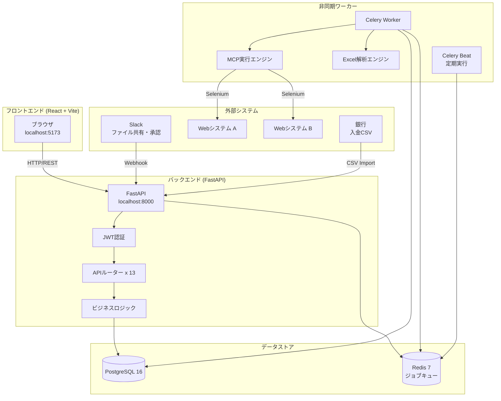
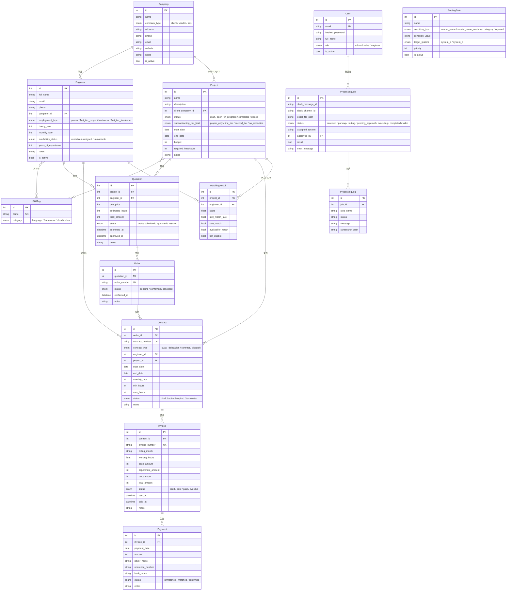
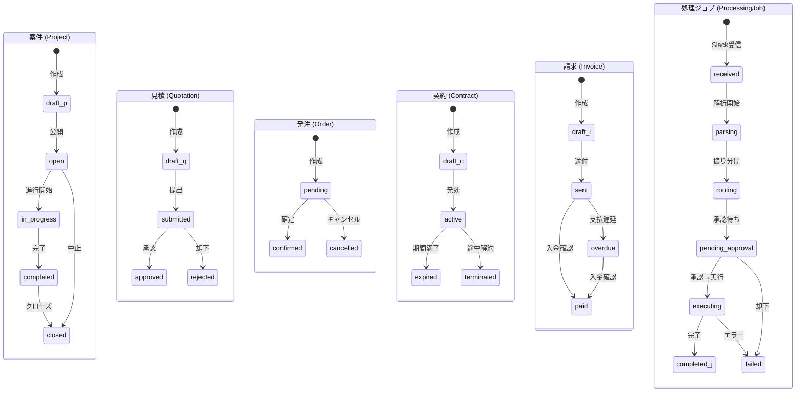
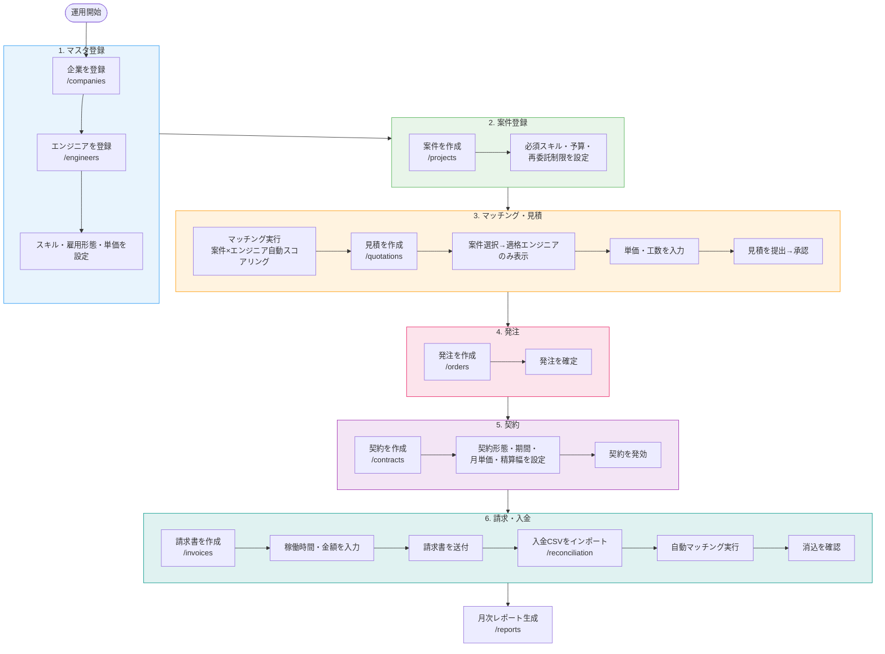
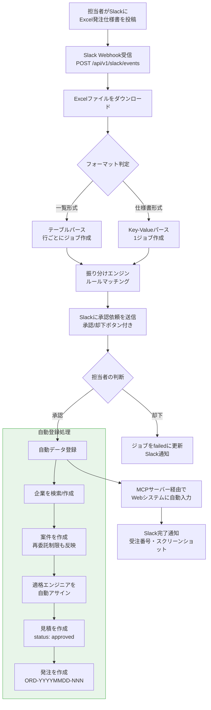
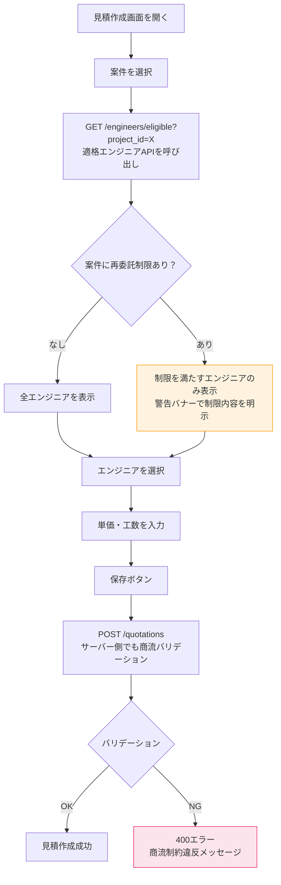
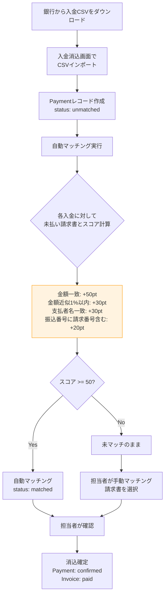
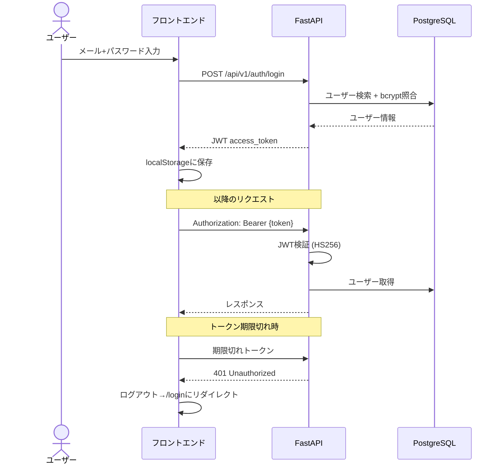
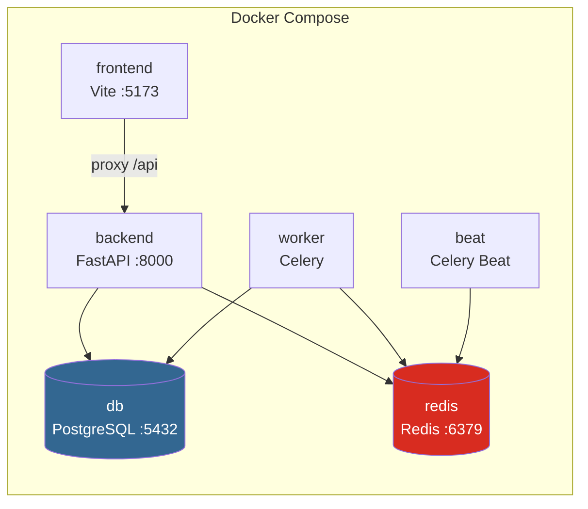

# AI受発注プラットフォーム システム仕様書

## 1. システム概要

SES（システムエンジニアリングサービス）業務における受発注管理を一元化するWebアプリケーション。
Slack・Excel・複数Webシステムにまたがる手動業務をデジタル化し、受発注フロー全体を自動化する。

### 目標指標

| 指標 | Before | After |
|------|--------|-------|
| 処理時間/件 | 15-30分 | 1-3分（確認のみ） |
| 担当者の関与 | 100%手動 | 10%（承認・例外対応のみ） |
| 転記ミス | 月数件 | ほぼゼロ |
| 処理件数/日 | 15-20件 | 100件以上 |

---

## 2. システムアーキテクチャ



### テックスタック

| レイヤー | 技術 |
|----------|------|
| フロントエンド | React 18, TypeScript, Vite, TailwindCSS, React Router v7 |
| バックエンド | FastAPI (Python 3.12), SQLAlchemy 2.0, Alembic |
| DB | PostgreSQL 16 |
| キャッシュ/キュー | Redis 7 |
| 認証 | JWT (python-jose) + bcrypt |
| 非同期ジョブ | Celery + Redis |
| Excel処理 | openpyxl |
| Slack連携 | slack-bolt / slack-sdk |
| MCP/ブラウザ自動操作 | Selenium WebDriver (Headless Chrome) |
| コンテナ | Docker Compose |

---

## 3. データモデル (ER図)



---

## 4. ステータス遷移



---

## 5. 画面一覧と運用ワークフロー

### 5.1 画面一覧

| パス | 画面名 | 主な機能 |
|------|--------|----------|
| `/login` | ログイン | メールアドレス+パスワード認証 |
| `/dashboard` | ダッシュボード | KPI統計、月次トレンド、最近の活動、エンジニア稼働率 |
| `/companies` | 企業管理 | 企業CRUD（クライアント/ベンダー/SES） |
| `/engineers` | エンジニア管理 | エンジニアCRUD、スキル・雇用形態・単価管理 |
| `/projects` | 案件管理 | 案件CRUD、スキル要件・予算・再委託制限設定 |
| `/quotations` | 見積管理 | 見積CRUD、案件選択→適格エンジニア動的フィルタ |
| `/orders` | 発注管理 | 発注の確認・キャンセル |
| `/contracts` | 契約管理 | 契約CRUD（準委任/請負/派遣） |
| `/invoices` | 請求管理 | 請求CRUD、PDF取込、送付・入金確認 |
| `/jobs` | 処理ジョブ | 自動処理ジョブの監視・承認・却下 |
| `/reconciliation` | 入金消込 | 入金CSVインポート、自動/手動マッチング |
| `/reports` | レポート | 月次レポート生成、スケジュール管理 |

### 5.2 手動運用ワークフロー（データ登録順序）

利用者が画面からデータを登録していく一連の流れ。



### 5.3 Slack自動化ワークフロー

Excel発注仕様書をSlackに投稿するだけで、案件・見積・発注が自動登録される。



### 5.4 見積作成時の商流チェックフロー



---

## 6. SES商流制約（再委託制限）

### 6.1 エンジニアのtier算出ルール

| 雇用形態 | 所属企業 | Tier | 説明 |
|----------|----------|------|------|
| `proper` | - | 0 | 自社正社員（プロパー） |
| `first_tier_proper` | - | 1 | 一社先のプロパー社員 |
| `freelancer` | なし | 1 | 直接契約の個人事業主 |
| `first_tier_freelancer` | - | 2 | 一社先の個人事業主 |
| `freelancer` | あり | 2 | パートナー企業経由の個人事業主 |

### 6.2 案件の再委託制限と許可tier

| 制限 | 許可tier | 説明 |
|------|----------|------|
| `proper_only` | 0のみ | プロパーのみ |
| `first_tier` | 0, 1 | 一社先まで |
| `second_tier` | 0, 1, 2 | 二社先まで |
| `no_restriction` / null | 全て | 制限なし |

### 6.3 適格判定マトリクス

| | proper<br/>(tier 0) | first_tier_proper<br/>(tier 1) | freelancer直接<br/>(tier 1) | first_tier_freelancer<br/>(tier 2) | freelancer+企業<br/>(tier 2) |
|---|:---:|:---:|:---:|:---:|:---:|
| **proper_only** | OK | NG | NG | NG | NG |
| **first_tier** | OK | OK | OK | NG | NG |
| **second_tier** | OK | OK | OK | OK | OK |
| **no_restriction** | OK | OK | OK | OK | OK |

---

## 7. 入金消込（Payment Reconciliation）

### 7.1 処理フロー



### 7.2 ファジーマッチング

- 企業名の正規化: `株式会社`/`(株)`/`有限会社`等の接頭辞を除去
- カタカナ正規化（全角→NFKC）
- Levenshtein距離による類似度判定（閾値: 0.7）

---

## 8. マッチングアルゴリズム（案件×エンジニア）

```
スコア = (スキル一致率 × 0.5) + (単価適合 × 0.25) + (稼働可否 × 0.25)

※ 商流不適格の場合はスコア = 0
```

| 要素 | 配点 | 判定条件 |
|------|------|----------|
| スキル一致率 | 0.0 - 0.5 | 一致スキル数 / 必須スキル数 × 0.5 |
| 単価適合 | 0 or 0.25 | エンジニア月単価 ≤ 案件予算 |
| 稼働可否 | 0 or 0.25 | availability_status == available |
| 商流適格 | - | 不適格の場合スコアを0に上書き |

---

## 9. APIエンドポイント一覧

### 認証

| Method | Path | 説明 |
|--------|------|------|
| POST | `/api/v1/auth/login` | ログイン（JWT発行） |
| POST | `/api/v1/auth/signup` | ユーザー登録 |
| GET | `/api/v1/auth/me` | 自分の情報取得 |

### マスタ管理

| Method | Path | 説明 |
|--------|------|------|
| GET | `/api/v1/companies` | 企業一覧（ページネーション、type/searchフィルタ） |
| POST | `/api/v1/companies` | 企業作成 |
| GET | `/api/v1/companies/{id}` | 企業詳細 |
| PUT | `/api/v1/companies/{id}` | 企業更新 |
| DELETE | `/api/v1/companies/{id}` | 企業削除（admin） |
| GET | `/api/v1/engineers` | エンジニア一覧（availability/company/searchフィルタ） |
| GET | `/api/v1/engineers/eligible` | 案件適格エンジニア一覧 |
| POST | `/api/v1/engineers` | エンジニア作成（スキル紐付け） |
| GET | `/api/v1/engineers/{id}` | エンジニア詳細 |
| PUT | `/api/v1/engineers/{id}` | エンジニア更新 |
| DELETE | `/api/v1/engineers/{id}` | エンジニア削除（admin） |

### 案件・見積・発注

| Method | Path | 説明 |
|--------|------|------|
| GET | `/api/v1/projects` | 案件一覧（status/client_companyフィルタ） |
| POST | `/api/v1/projects` | 案件作成（スキル要件紐付け） |
| GET | `/api/v1/projects/{id}` | 案件詳細 |
| PUT | `/api/v1/projects/{id}` | 案件更新 |
| DELETE | `/api/v1/projects/{id}` | 案件削除（admin） |
| GET | `/api/v1/quotations` | 見積一覧（status/projectフィルタ） |
| POST | `/api/v1/quotations` | 見積作成（商流バリデーション） |
| GET | `/api/v1/quotations/{id}` | 見積詳細 |
| PUT | `/api/v1/quotations/{id}` | 見積更新 |
| DELETE | `/api/v1/quotations/{id}` | 見積削除（admin） |
| POST | `/api/v1/quotations/{id}/submit` | 見積提出 |
| POST | `/api/v1/quotations/{id}/approve` | 見積承認 |
| GET | `/api/v1/orders` | 発注一覧 |
| POST | `/api/v1/orders` | 発注作成 |
| GET | `/api/v1/orders/{id}` | 発注詳細 |
| PUT | `/api/v1/orders/{id}` | 発注更新 |
| DELETE | `/api/v1/orders/{id}` | 発注削除（admin） |
| POST | `/api/v1/orders/{id}/confirm` | 発注確定 |

### 契約・請求

| Method | Path | 説明 |
|--------|------|------|
| GET | `/api/v1/contracts` | 契約一覧（status/engineer/projectフィルタ） |
| POST | `/api/v1/contracts` | 契約作成 |
| GET | `/api/v1/contracts/{id}` | 契約詳細 |
| PUT | `/api/v1/contracts/{id}` | 契約更新 |
| DELETE | `/api/v1/contracts/{id}` | 契約削除（admin） |
| GET | `/api/v1/invoices` | 請求一覧（status/contractフィルタ） |
| POST | `/api/v1/invoices` | 請求作成 |
| GET | `/api/v1/invoices/{id}` | 請求詳細 |
| PUT | `/api/v1/invoices/{id}` | 請求更新 |
| DELETE | `/api/v1/invoices/{id}` | 請求削除（admin） |
| POST | `/api/v1/invoices/{id}/send` | 請求送付 |
| POST | `/api/v1/invoices/{id}/pay` | 入金確認 |
| POST | `/api/v1/invoices/import` | 請求書PDFインポート |

### マッチング

| Method | Path | 説明 |
|--------|------|------|
| POST | `/api/v1/matching/run` | マッチング実行 |
| GET | `/api/v1/matching/results` | マッチング結果一覧 |

### 自動化

| Method | Path | 説明 |
|--------|------|------|
| GET | `/api/v1/jobs` | 処理ジョブ一覧 |
| GET | `/api/v1/jobs/{id}` | ジョブ詳細 |
| POST | `/api/v1/jobs/{id}/approve` | ジョブ承認/却下 |
| GET | `/api/v1/jobs/tasks/{task_id}/status` | 非同期タスク状況 |
| POST | `/api/v1/slack/events` | Slack Event Webhook |
| POST | `/api/v1/slack/interactions` | Slack Interactive Webhook |

### ダッシュボード

| Method | Path | 説明 |
|--------|------|------|
| GET | `/api/v1/dashboard/stats` | KPI統計 |
| GET | `/api/v1/dashboard/recent-activities` | 最近の活動 |
| GET | `/api/v1/dashboard/monthly-trends` | 月次トレンド（6ヶ月） |
| GET | `/api/v1/dashboard/engineer-utilization` | エンジニア稼働率 |

### 入金消込

| Method | Path | 説明 |
|--------|------|------|
| POST | `/api/v1/reconciliation/import` | 入金CSVインポート |
| POST | `/api/v1/reconciliation/match` | 自動マッチング実行 |
| GET | `/api/v1/reconciliation` | 入金一覧 |
| GET | `/api/v1/reconciliation/summary` | 消込サマリー |
| POST | `/api/v1/reconciliation/{id}/match` | 手動マッチング |
| POST | `/api/v1/reconciliation/{id}/confirm` | 消込確定 |
| POST | `/api/v1/reconciliation/{id}/unmatch` | マッチング取消 |

### レポート

| Method | Path | 説明 |
|--------|------|------|
| POST | `/api/v1/reports/generate` | レポート生成（Excel） |
| GET | `/api/v1/reports/types` | レポート種別一覧 |
| GET | `/api/v1/reports/schedules` | スケジュール一覧 |
| POST | `/api/v1/reports/schedules` | スケジュール作成 |
| PUT | `/api/v1/reports/schedules/{id}` | スケジュール更新 |
| DELETE | `/api/v1/reports/schedules/{id}` | スケジュール削除（admin） |

### ヘルスチェック

| Method | Path | 説明 |
|--------|------|------|
| GET | `/api/health` | サーバー稼働確認 |

---

## 10. 認証・認可

### 認証フロー



### ロール権限

| 操作 | admin | sales | engineer |
|------|:-----:|:-----:|:--------:|
| データ閲覧 | OK | OK | OK |
| データ作成・更新 | OK | OK | - |
| データ削除 | OK | - | - |
| ジョブ承認 | OK | OK | - |
| レポート生成 | OK | OK | - |

---

## 11. Docker構成



| サービス | イメージ | ポート | 役割 |
|----------|---------|--------|------|
| db | postgres:16 | 5432 | データベース |
| redis | redis:7 | 6379 | ジョブキュー |
| backend | python:3.12 | 8000 | APIサーバー |
| frontend | node:20 | 5173 | フロントエンド開発サーバー |
| worker | python:3.12 | - | 非同期ジョブ実行 |
| beat | python:3.12 | - | 定期ジョブスケジューラ |

---

## 12. Alembicマイグレーション履歴

| Revision | 説明 |
|----------|------|
| `644191d9d074` | 初期スキーマ（全テーブル作成） |
| `abeb11174ac4` | payments テーブル追加 |
| `c3f8a2d1e5b7` | 商流制約フィールド追加（employment_type, subcontracting_tier_limit, tier_eligible） |
| `d4e5f6a7b8c9` | 新商流enum値追加（first_tier_proper, first_tier_freelancer, second_tier） |

---

## 13. テスト

- **テストフレームワーク**: pytest
- **テストDB**: SQLite in-memory
- **テスト数**: 210件（うち1件は既知の未実装モジュール依存で失敗）
- **実行コマンド**: `PYTHONPATH=. .venv/bin/python -m pytest tests/ -x -v`

| テストファイル | テスト数 | 対象 |
|----------------|----------|------|
| test_auth.py | 6 | 認証（signup/login/me） |
| test_companies.py | 8 | 企業CRUD |
| test_engineers.py | 14 | エンジニアCRUD + 適格API |
| test_projects.py | 8 | 案件CRUD |
| test_quotations.py | 15 | 見積CRUD + 商流バリデーション |
| test_orders.py | 8 | 発注CRUD |
| test_contracts.py | 7 | 契約CRUD |
| test_invoices.py | 10 | 請求CRUD |
| test_matching.py | 8 | マッチングアルゴリズム |
| test_tier_eligibility.py | 30 | 商流制約ロジック全組み合わせ |
| test_dashboard.py | 9 | ダッシュボードAPI |
| test_jobs.py | 14 | 処理ジョブ + 自動登録 |
| test_slack.py | 17 | Slack連携 |
| test_reconciliation.py | 30 | 入金消込 + ファジーマッチ |
| test_rbac.py | 15 | ロールベースアクセス制御 |
| test_reports.py | 11 | レポート生成 |
